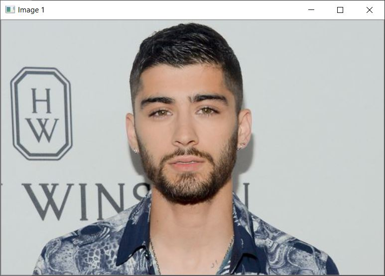
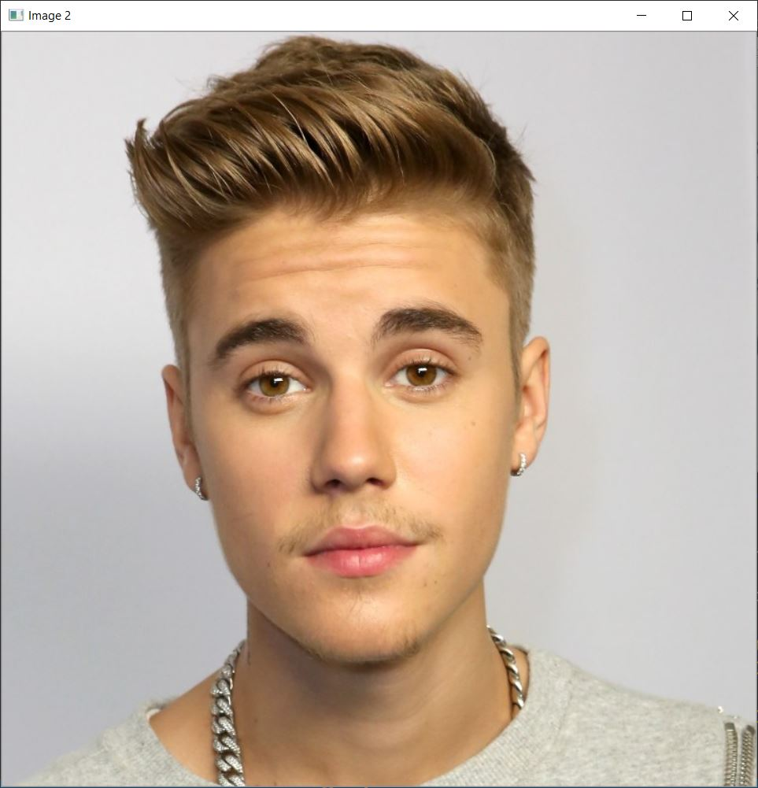
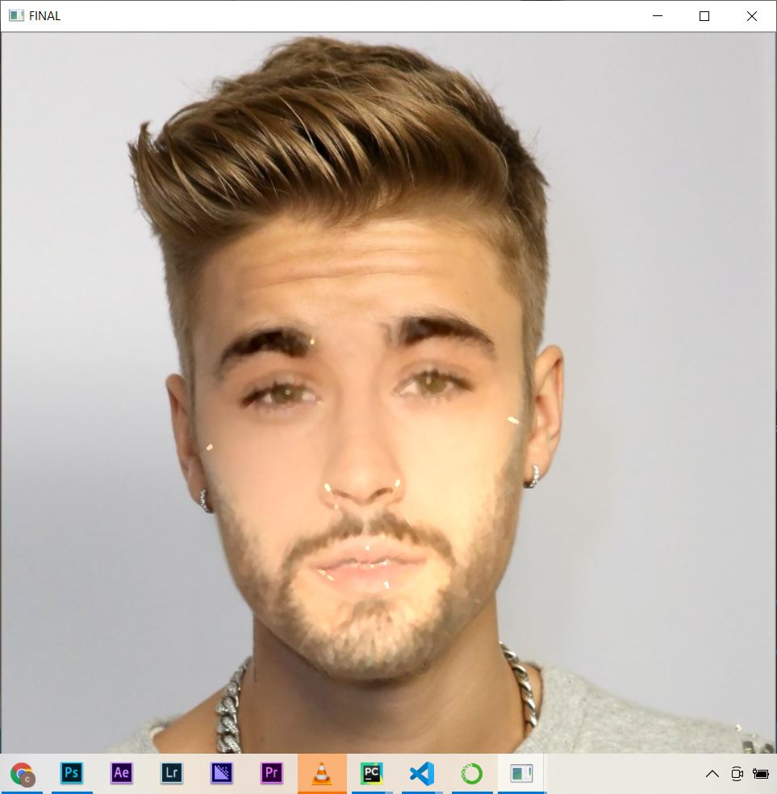

- This projct is same as snapchat face swapping filter. 
- You have to provide 2 input images and it will merge both images and produce new image.

<b>Dependency Used:</b>
- dlib : for landmark's facial detector with pre-trained models
- openCV : for image read & write operation

<b>Input Image 1:</b>

<b>Input Image 2:</b>

<b>Output Image:</b>

